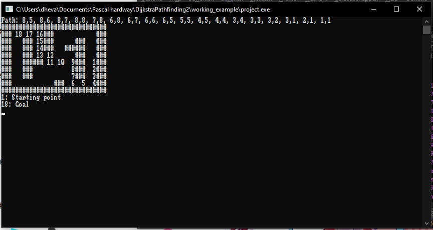

# Dijkstra's Pathfinding Algorithm

I made this based on https://www.datacamp.com/tutorial/dijkstra-algorithm-in-python

Using rtl-generics (`Generics.Collections`) instead of `FGL` because the API is easier.
